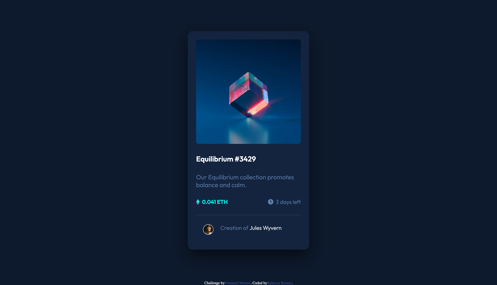
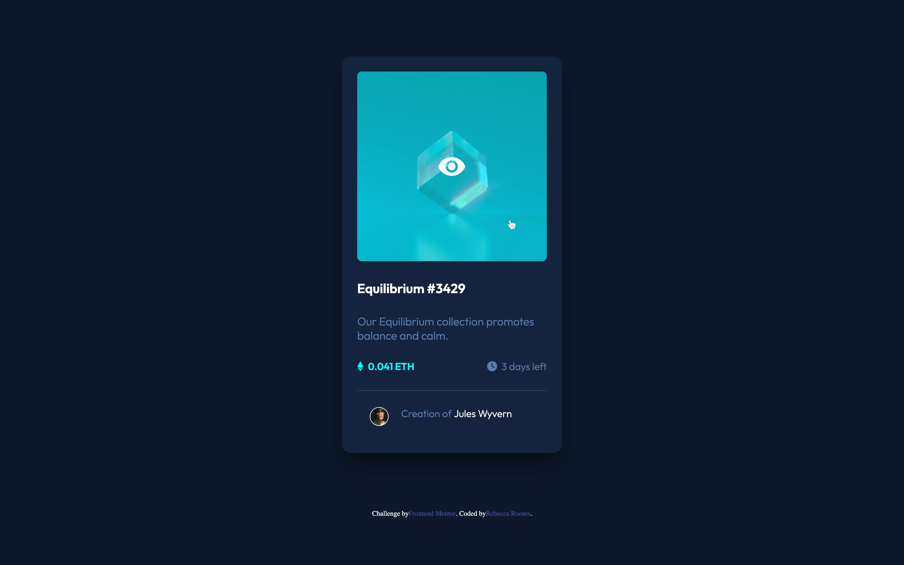

# Frontend Mentor - NFT preview card component solution

This is a solution to the [NFT preview card component challenge on Frontend Mentor](https://www.frontendmentor.io/challenges/nft-preview-card-component-SbdUL_w0U). Frontend Mentor challenges help you improve your coding skills by building realistic projects.

## Table of contents

- [Overview](#overview)
  - [The challenge](#the-challenge)
  - [Screenshots](#screenshots)
  - [Links](#links)
- [My process](#my-process)
  - [Built with](#built-with)
  - [What I learned](#what-i-learned)
  - [Continued development](#continued-development)
  - [Useful resources](#useful-resources)
- [Author](#author)

## Overview

### The challenge

Users should be able to:

- View the optimal layout depending on their device's screen size
- See hover states for interactive elements

### Screenshots




### Links

- Solution URL: [My Solution](https://beksterslab.github.io/NFT-preview-card-component/)

## My process

### Built with

- Semantic HTML5 markup
- CSS custom properties
- Flexbox

### What I learned

Adding icons using fontawesome.com.
Start > Other Ways to Use > Download > Free For Web - download and extract.
Copy and paste the following into your project folder:
webfonts folder - into your main folder
all.min.css file - into your css folder
In index.html, add a link above your .css link to the all.min.css file
Now search for icons on fontawesome.com and copy/paste the code into your .html document. For example...

```html
<i class="fa-brands fa-ethereum"></i>
```

I struggled with changing the colour of the image on hover. It felt like it should have been easy to overlay a semi-transparent colour but I couldn't get it to work.
Fix: I altered the image in photoshop using a fill layer in the cyan colour and reducing the opacity to 60%. I scaled up the eye icon in Canva and saved as a .png file, bringing into photoshop and selecting and filling the content on a new layer with white.
The new image was saved and used to swap out the main image on hover.

I couldn't get the flex-container to align to the middle of the window vertically. I fixed this using a media query so it automatically has a margin of 90px on larger screens but drops to 30px on a mobile device with a width of 480px or less.

### Continued development

Further revision/work is required on flexbox and effects on images upon hover.
I need to figure out how to centrally align the avatar and text at the bottom horizontally as it is slightly off.

### Useful resources

- [Tutorial Republic - Change Image on Hover with CSS](https://www.tutorialrepublic.com/faq/how-to-change-image-on-hover-with-css.php) - This helped me with swapping out the image on hover.
- [Stackoverflow](https://stackoverflow.com/questions/18606473/css-scale-down-image-to-fit-in-containing-div-without-specifing-original-size) - This helped me fix the image size as it was too large and specifying 100% didn't work.

## Author

- Frontend Mentor - [@BekstersLab](https://www.frontendmentor.io/profile/BekstersLab)
